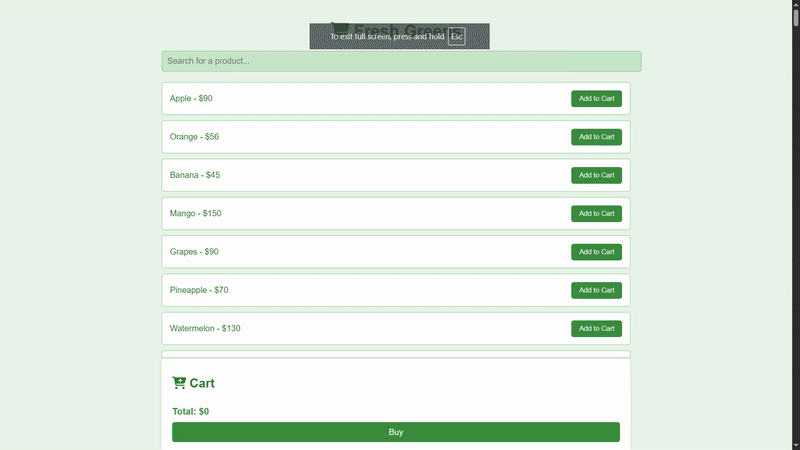

# Fresh Greens Store

This is a simple online store web application where users can browse products, add them to the shopping cart, and view the total cost with an optional discount. The store's product data is loaded from a JSON file, and the cart and total price are dynamically updated as users interact with the site.

## Features

- **Search Products**: Users can search for products by name.
- **Add to Cart**: Users can add products to their shopping cart.
- **Cart Summary**: Displays a list of items added to the cart along with their prices.
- **Total Calculation**: Shows the total price of the items in the cart, with a discount applied for orders above $1000.
- **Sticky Footer**: The cart and total summary stay visible at the bottom of the screen even when scrolling.

Demo:

## Technologies Used

- **HTML**: Used to structure the content of the web page.
- **CSS**: Styles the web page and makes it responsive.
- **JavaScript**: Handles the dynamic functionality like adding products to the cart, updating the total price, and filtering products.
- **Font Awesome**: For displaying icons like the shopping cart.

